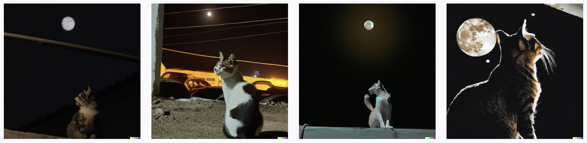

# Pictionary with DALL-E 
Can you guess the prompt? 



For more [Prompt ideas](https://twitter.com/BecomingCritter/status/1511808277490896903 )..

## What is it?
We all love playing pictionary... But sometimes, you have those days when you would rather not draw.

Worry not, we have [DALL-E](https://openai.com/dall-e-2/) to paint the picture for you!

## How does it work?
### Generating the Picture
Like a standard pictionary game, one person from a team generates a picture with DALL-E (or Stable Diffusion, whichever your favorite image generator is). The prompt used to generate will the "golden solution." 
- $targetPrompt$

### Guessing the Prompt
Now, the generate image is shown to the whole group. Each team has 1 minute  to guess the used prompt:
- $\{i \in N \mid predPrompt_{i}\}$


### Measuring Similarity
Once the predicted prompts are collected, we first encode the text using OpenAI's [tiktoken tokenizer](https://github.com/openai/tiktoken#readme):
- $enc(\cdot)$

Then, we can use cosine similarity to measure how accurate the predictions are. This is quickly done in linear time by comparing the encoded embeddings of the solution to that of every prediction: 
- $enc(targetPrompt)$   $\cdot$ $enc(predPrompt_{i})$

### Winner?
Sort the cosine similarity and select the top-$k$ highest values to select the $k$ winners.

## Usage


### Tokenization (Hugging Face)
Hugging Face Transformers provide free embeddings!

### Tokenization (OpenAI)
tiktoken is a fast [BPE](https://en.wikipedia.org/wiki/Byte_pair_encoding) tokeniser for use with OpenAI's models. More examples of usage in the [OpenAI Cookbook](https://github.com/openai/openai-cookbook/blob/main/examples/How_to_count_tokens_with_tiktoken.ipynb) and documentation.

```python
import tiktoken
enc = tiktoken.get_encoding("gpt2")
assert enc.decode(enc.encode("hello world")) == "hello world"

# To get the tokeniser corresponding to a specific model in the OpenAI API:
enc = tiktoken.encoding_for_model("text-davinci-003")
```

The open source version of `tiktoken` can be installed from PyPI:
```
pip install tiktoken
```